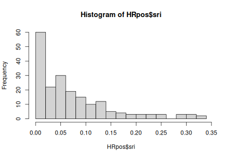
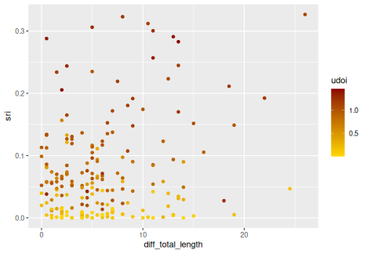
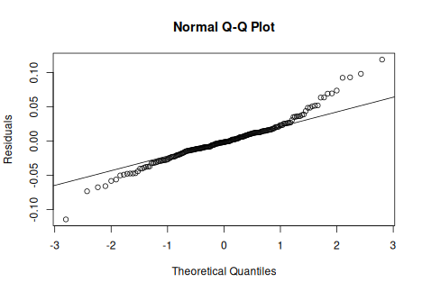
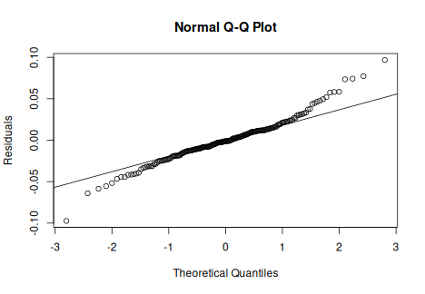
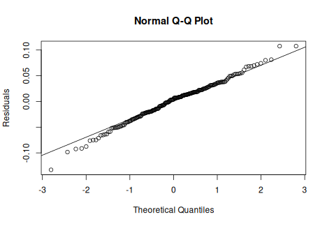
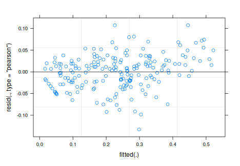
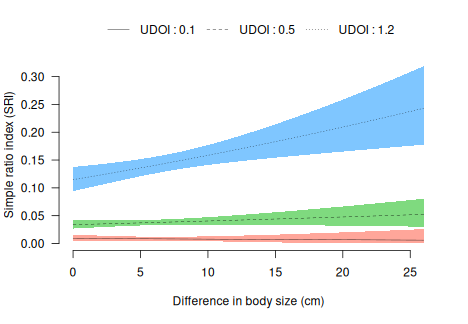

# 2023-03-09


```r
knitr::opts_chunk$set(dev = "png")
knitr::opts_knit$set(root.dir = rprojroot::find_rstudio_root_file())
```


```r
# === Model - glmm --------------------------------------------------------


# Packages ----------------------------------------------------------------
library(lme4)
library(ggplot2)
library(visreg)
library(data.table)
library(sjstats)
library(performance)

#input data
data=readRDS("output/09-all-dyad-data.Rds")

summary(data)
```

```
##     dyadID              ID1                ID2                 Year     
##  Length:253         Length:253         Length:253         Min.   :2017  
##  Class :character   Class :character   Class :character   1st Qu.:2018  
##  Mode  :character   Mode  :character   Mode  :character   Median :2018  
##                                                           Mean   :2018  
##                                                           3rd Qu.:2019  
##                                                           Max.   :2019  
##       sri               udoi         diff_total_length diff_heart_girth
##  Min.   :0.00000   Min.   :0.00000   Min.   : 0.000    Min.   : 0.000  
##  1st Qu.:0.00000   1st Qu.:0.03096   1st Qu.: 2.000    1st Qu.: 1.500  
##  Median :0.02927   Median :0.31326   Median : 5.000    Median : 4.000  
##  Mean   :0.05699   Mean   :0.49570   Mean   : 5.895    Mean   : 4.439  
##  3rd Qu.:0.08419   3rd Qu.:0.93161   3rd Qu.: 8.000    3rd Qu.: 6.000  
##  Max.   :0.32666   Max.   :1.46212   Max.   :26.000    Max.   :14.000  
##  diff_sum_heart_length
##  Min.   : 0.000       
##  1st Qu.: 3.500       
##  Median : 7.500       
##  Mean   : 8.571       
##  3rd Qu.:12.000       
##  Max.   :38.000
```

```r
str(data)
```

```
## Classes 'data.table' and 'data.frame':	253 obs. of  9 variables:
##  $ dyadID               : chr  "FO2016002-FO2016003" "FO2016002-FO2016004" "FO2016002-FO2016004" "FO2016002-FO2016005" ...
##  $ ID1                  : chr  "FO2016003" "FO2016004" "FO2016004" "FO2016005" ...
##  $ ID2                  : chr  "FO2016002" "FO2016002" "FO2016002" "FO2016002" ...
##  $ Year                 : int  2017 2017 2018 2017 2018 2019 2017 2019 2017 2018 ...
##  $ sri                  : num  0.0851 0.1124 0.0821 0.0936 0.1111 ...
##  $ udoi                 : num  1.253 0.932 0.277 0.577 0.334 ...
##  $ diff_total_length    : num  11 0.5 0.5 5.5 5.5 5.5 13.5 0 5 5 ...
##  $ diff_heart_girth     : num  2.5 1 1 4 4 4 9 6 3 3 ...
##  $ diff_sum_heart_length: num  8.5 0.5 0.5 9.5 9.5 9.5 22.5 6 8 8 ...
##  - attr(*, "sorted")= chr [1:3] "dyadID" "ID1" "ID2"
##  - attr(*, ".internal.selfref")=<externalptr>
```

```r
# Does caribou associate according to size similarity? --------------------
# Expected = SRI is higher when diff in body size is small 

# We work with caribou in the same HR (udoi>0)
HRpos=subset(data,udoi>0)  
HRpos[ , Difference:= diff_total_length]

# Data exploration
hist(HRpos$sri, breaks = 20)
```

<!-- --> 

```r
plot2=ggplot(HRpos,aes(x=diff_total_length,y=sri, color=udoi))+geom_point()
plot2+scale_color_gradient(low="gold", high="dark red")
```

<!-- --> 

```r
#  GLMMs ------------------------------------------------------------------


# with diff in (heart girth + total length)

mod1=lmer(sri~Difference *udoi + Difference+udoi+(1|dyadID)+(1|Year), data=HRpos)

mod1.1=lmer(log(sri+1)~Difference*udoi + Difference+udoi+(1|dyadID)+(1|Year), data=HRpos) # with log

mod1.2=lmer(sqrt(sri)~udoi*Difference+udoi+ Difference +(1|dyadID)+(1|Year), data=HRpos) # with sqrt


# par(mfrow=c(1,3))
qqnorm(residuals(mod1),ylab="Residuals")   #ko
qqline(residuals(mod1))
```

<!-- --> 

```r
qqnorm(residuals(mod1.1),ylab="Residuals")   #ko
qqline(residuals(mod1.1))
```

<!-- --> 

```r
qqnorm(residuals(mod1.2),ylab="Residuals")   #ok
qqline(residuals(mod1.2))
```

<!-- --> 

```r
# par()

plot(mod1.2)    #homoscedasticity ok
```

<!-- --> 

```r
shapiro.test((residuals(mod1.2)))
```

```
## 
## 	Shapiro-Wilk normality test
## 
## data:  (residuals(mod1.2))
## W = 0.99209, p-value = 0.3635
```

```r
# p-value
Vcov <- vcov(mod1.2, useScale = FALSE)
betas <- fixef(mod1.2)
se <- sqrt(diag(Vcov))
zval <- betas / se
pval <- 2 * pnorm(abs(zval), lower.tail = FALSE)
round(cbind(betas, se, zval, pval), digits = 3)
```

```
##                  betas    se   zval  pval
## (Intercept)      0.096 0.022  4.333 0.000
## udoi             0.199 0.020  9.815 0.000
## Difference      -0.003 0.002 -1.446 0.148
## udoi:Difference  0.007 0.003  2.855 0.004
```

```r
#                 betas    se   zval  pval
#Intercept)       0.096 0.022  4.333 0.000
#udoi             0.199 0.020  9.815 0.000
#Difference      -0.003 0.002 -1.446 0.148
#udoi:Difference  0.007 0.003  2.855 0.004

r2(mod1.2)
```

```
## # R2 for Mixed Models
## 
##   Conditional R2: 0.844
##      Marginal R2: 0.610
```

```r
#Conditional R2: 0.844
#Marginal R2: 0.610


# ====> Caribou associate more often when HR overlap is bigger and big difference in size


# Plots of the fixed effects ----------------------------------------------

#Backtranformation of the sqrt of the response
square <- function(x){
  return(x**2)
}

# random effect removed for plot, otherwise, no CI on the graph

HRpos$UDOI=HRpos$udoi
mod1.A=lm(sqrt(sri)~Difference*UDOI, data=HRpos)
# dev.off()
visreg(mod1.A,"Difference", by="UDOI", 
       
       breaks = c(0.1, 0.5, 1.2),
       
       trans=square,xlab="Difference in body size (cm)",
       ylab="Simple ratio index (SRI)", overlay = TRUE, partial = FALSE, rug=FALSE, frame.plot=FALSE,legend=TRUE,
       line=list(lty=1:3, col="black", lwd=0.5))
```

<!-- --> 

```r
# -------------------------------------------------------------------------

mod1
```

```
## Linear mixed model fit by REML ['lmerMod']
## Formula: sri ~ Difference * udoi + Difference + udoi + (1 | dyadID) +  
##     (1 | Year)
##    Data: HRpos
## REML criterion at convergence: -592.9123
## Random effects:
##  Groups   Name        Std.Dev.
##  dyadID   (Intercept) 0.03109 
##  Year     (Intercept) 0.01391 
##  Residual             0.03841 
## Number of obs: 197, groups:  dyadID, 155; Year, 3
## Fixed Effects:
##     (Intercept)       Difference             udoi  Difference:udoi  
##        0.007752        -0.001899         0.084265         0.005678
```

```r
mod1.1
```

```
## Linear mixed model fit by REML ['lmerMod']
## Formula: log(sri + 1) ~ Difference * udoi + Difference + udoi + (1 | dyadID) +  
##     (1 | Year)
##    Data: HRpos
## REML criterion at convergence: -644.8071
## Random effects:
##  Groups   Name        Std.Dev.
##  dyadID   (Intercept) 0.02802 
##  Year     (Intercept) 0.01245 
##  Residual             0.03300 
## Number of obs: 197, groups:  dyadID, 155; Year, 3
## Fixed Effects:
##     (Intercept)       Difference             udoi  Difference:udoi  
##        0.008994        -0.001683         0.077859         0.004870
```

```r
mod1.2
```

```
## Linear mixed model fit by REML ['lmerMod']
## Formula: sqrt(sri) ~ udoi * Difference + udoi + Difference + (1 | dyadID) +  
##     (1 | Year)
##    Data: HRpos
## REML criterion at convergence: -402.242
## Random effects:
##  Groups   Name        Std.Dev.
##  dyadID   (Intercept) 0.06233 
##  Year     (Intercept) 0.02395 
##  Residual             0.05457 
## Number of obs: 197, groups:  dyadID, 155; Year, 3
## Fixed Effects:
##     (Intercept)             udoi       Difference  udoi:Difference  
##        0.096127         0.198669        -0.003281         0.007336
```
