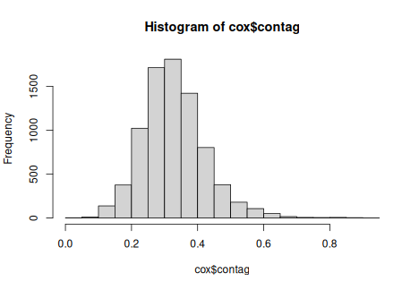

# 2023-03-09


```r
knitr::opts_chunk$set(dev = "png")
knitr::opts_knit$set(root.dir = rprojroot::find_rstudio_root_file())
```


```r
# === Model - cox ---------------------------------------------------------


# Packages ----------------------------------------------------------------
library(coxme)
library(data.table)
library(AICcmodavg)
library(ggplot2)
library(survival)


# input files
COX = readRDS('output/08-intervals.Rds')
body = readRDS('output/09-all-dyad-data.Rds')
cox = merge(COX, body, by = c('dyadID', 'Year'))

# Fission event = 1
cox[, stayedTogether := ifelse(stayedTogether == TRUE, 0, 1)]
cox[, fission := stayedTogether]
cox[, diff_size := diff_sum_heart_length]

#same scale for contagion and openness
cox[, contag := value / 100]

# remove NA
cox <- cox[!is.na(dyadPropOpen)]
cox <- cox[!is.na(ShanIndex)]
cox <- cox[!is.na(diff_size)]
cox <- cox[!is.na(contag)]

hist(cox$contag)
```

<!-- --> 

```r
# Survival analysis Cox PHM -----------------------------------------------

str(cox)
```

```
## Classes 'data.table' and 'data.frame':	8040 obs. of  25 variables:
##  $ dyadID               : chr  "FO2016002-FO2016003" "FO2016002-FO2016003" "FO2016002-FO2016003" "FO2016002-FO2016003" ...
##  $ Year                 : int  2017 2017 2017 2017 2017 2017 2017 2017 2017 2017 ...
##  $ ANIMAL_ID            : chr  "FO2016002" "FO2016002" "FO2016002" "FO2016002" ...
##  $ NN                   : chr  "FO2016003" "FO2016003" "FO2016003" "FO2016003" ...
##  $ start                : int  230 231 232 233 374 375 376 377 389 390 ...
##  $ stop                 : int  231 232 233 234 375 376 377 378 390 391 ...
##  $ falsefission         : logi  FALSE FALSE FALSE FALSE FALSE FALSE ...
##  $ stayedTogether       : num  0 0 0 1 0 0 0 1 0 0 ...
##  $ dyadPropOpen         : num  0.628 0.628 0.723 0.65 0.752 ...
##  $ ShanIndex            : num  1.46 1.46 1.28 1.44 1.55 ...
##  $ dyadLC               : chr  "Conifer Scrub" "Conifer Scrub" "Lichen and Heath" "Lichen and Heath" ...
##  $ metric               : chr  "contag" "contag" "contag" "contag" ...
##  $ value                : num  45.1 45.1 46 41.3 34.7 ...
##  $ plot_id              : int  229 230 231 232 372 373 374 3059 3071 388 ...
##  $ percentage_inside    : num  85.3 85.3 85.3 88.9 76.7 ...
##  $ ID1                  : chr  "FO2016003" "FO2016003" "FO2016003" "FO2016003" ...
##  $ ID2                  : chr  "FO2016002" "FO2016002" "FO2016002" "FO2016002" ...
##  $ sri                  : num  0.0851 0.0851 0.0851 0.0851 0.0851 ...
##  $ udoi                 : num  1.25 1.25 1.25 1.25 1.25 ...
##  $ diff_total_length    : num  11 11 11 11 11 11 11 11 11 11 ...
##  $ diff_heart_girth     : num  2.5 2.5 2.5 2.5 2.5 2.5 2.5 2.5 2.5 2.5 ...
##  $ diff_sum_heart_length: num  8.5 8.5 8.5 8.5 8.5 8.5 8.5 8.5 8.5 8.5 ...
##  $ fission              : num  0 0 0 1 0 0 0 1 0 0 ...
##  $ diff_size            : num  8.5 8.5 8.5 8.5 8.5 8.5 8.5 8.5 8.5 8.5 ...
##  $ contag               : num  0.451 0.451 0.46 0.413 0.347 ...
##  - attr(*, ".internal.selfref")=<externalptr> 
##  - attr(*, "sorted")= chr [1:2] "dyadID" "Year"
```

```r
cox$fission = as.integer(cox$fission)
cox$Year = as.factor(cox$Year)

surv_object <- Surv(cox$start, cox$stop, cox$fission)

## If HR<1 = less risk that the dyad does not survive = stay longer together
## exp(coeff) = hazard ratio in the output


# Backward selection from the interactions that make sense biologicaaly

m1<-coxme(surv_object~ sri+diff_size+ShanIndex+contag+dyadPropOpen+ sri*diff_size+sri*ShanIndex+sri*contag+
               sri*dyadPropOpen+diff_size*ShanIndex+diff_size*contag+(1|dyadID)+(1|Year), data=cox)  
AIC(m1) #3506.501
```

```
## [1] 3506.501
```

```r
# - sri*ShanIndex

m2<-coxme(surv_object~ sri+diff_size+ShanIndex+contag+dyadPropOpen+
               sri*diff_size+sri*contag+
               sri*dyadPropOpen+diff_size*ShanIndex+diff_size*contag+(1|dyadID)+(1|Year), data=cox) 
AIC(m2) # 3504.635
```

```
## [1] 3504.635
```

```r
#- sri*contag

m3<-coxme(surv_object~ sri+diff_size+ShanIndex+contag+dyadPropOpen+
               sri*diff_size+
               sri*dyadPropOpen+diff_size*ShanIndex+diff_size*contag+(1|dyadID)+(1|Year), data=cox) 
AIC(m3)# 3502.772
```

```
## [1] 3502.772
```

```r
# - sri*size

m4<-coxme(surv_object~ sri+diff_size+ShanIndex+contag+dyadPropOpen+
               sri*dyadPropOpen+diff_size*ShanIndex+diff_size*contag+(1|dyadID)+(1|Year), data=cox) 

AIC(m4)# 3502.298
```

```
## [1] 3502.298
```

```r
# -sri*open

m5<-coxme(surv_object~ sri+diff_size+ShanIndex+contag+dyadPropOpen+
               diff_size*ShanIndex+diff_size*contag+(1|dyadID)+(1|Year), data=cox) 

AIC(m5)# 3500.976
```

```
## [1] 3500.976
```

```r
# -size*ShanIndex

m6<-coxme(surv_object~ sri+diff_size+ShanIndex+contag+dyadPropOpen+
               diff_size*contag+(1|dyadID)+(1|Year), data=cox) 

AIC(m6)# 3500.554
```

```
## [1] 3500.554
```

```r
#- size*contag

m7<-coxme(surv_object~ sri+diff_size+ShanIndex+contag+dyadPropOpen+
               (1|dyadID)+(1|Year), data=cox)
AIC(m7)# 3499.792
```

```
## [1] 3499.792
```

```r
# - size
# ===> final model


#Check of the proportional hazards assumptions

m7<-coxph(surv_object~ sri+diff_size+ShanIndex+contag+dyadPropOpen, data=cox)
cox.zph(m7)
```

```
##              chisq df    p
## sri          0.898  1 0.34
## diff_size    1.895  1 0.17
## ShanIndex    0.549  1 0.46
## contag       1.421  1 0.23
## dyadPropOpen 2.404  1 0.12
## GLOBAL       4.998  5 0.42
```

```r
# m7                  coef exp(coef)  se(coef)     z      p
#sri          -1.703383294 0.1820665 0.639112738 -2.67 0.0077
#diff_size     0.004127345 1.0041359 0.007372678  0.56 0.5800
#ShanIndex     0.516934180 1.6768788 0.222095625  2.33 0.0200
#contag        0.401085033 1.4934443 0.426264086  0.94 0.3500
#dyadPropOpen  0.400738669 1.4929271 0.216653649  1.85 0.0640

exp(confint(m7, level=0.95))
```

```
##                   2.5 %    97.5 %
## sri          0.06769332 0.2807858
## diff_size    0.99710845 1.0138778
## ShanIndex    1.12965659 2.5042330
## contag       0.45986483 2.1483131
## dyadPropOpen 1.37238030 2.9300984
```

```r
# -------------------------------------------------------------------------
m1
```

```
## Cox mixed-effects model fit by maximum likelihood
##   Data: cox
##   events, n = 1617, 8040
##   Iterations= 12 67 
##                     NULL Integrated    Fitted
## Log-likelihood -1861.529  -1760.526 -1681.179
## 
##                    Chisq    df p    AIC     BIC
## Integrated loglik 202.01 13.00 0 176.01  105.96
##  Penalized loglik 360.70 72.07 0 216.56 -171.79
## 
## Model:  surv_object ~ sri + diff_size + ShanIndex + contag + dyadPropOpen +      sri * diff_size + sri * ShanIndex + sri * contag + sri *      dyadPropOpen + diff_size * ShanIndex + diff_size * contag +      (1 | dyadID) + (1 | Year) 
## Fixed coefficients
##                            coef exp(coef)   se(coef)     z    p
## sri                 -2.01826252 0.1328862 5.04172174 -0.40 0.69
## diff_size           -0.07641343 0.9264331 0.05899325 -1.30 0.20
## ShanIndex            0.21673951 1.2420205 0.41408211  0.52 0.60
## contag              -0.54629436 0.5790917 0.83811498 -0.65 0.51
## dyadPropOpen         0.21117883 1.2351332 0.39237795  0.54 0.59
## sri:diff_size       -0.03466395 0.9659300 0.06956079 -0.50 0.62
## sri:ShanIndex       -0.46228084 0.6298454 2.30927027 -0.20 0.84
## sri:contag           1.30197158 3.6765381 4.59506463  0.28 0.78
## sri:dyadPropOpen     1.18650694 3.2756193 2.08736627  0.57 0.57
## diff_size:ShanIndex  0.03936880 1.0401540 0.03042709  1.29 0.20
## diff_size:contag     0.07992769 1.0832087 0.05994932  1.33 0.18
## 
## Random effects
##  Group  Variable  Std Dev   Variance 
##  dyadID Intercept 0.3978736 0.1583034
##  Year   Intercept 0.1000000 0.0100000
```

```r
m2
```

```
## Cox mixed-effects model fit by maximum likelihood
##   Data: cox
##   events, n = 1617, 8040
##   Iterations= 12 67 
##                     NULL Integrated    Fitted
## Log-likelihood -1861.529  -1760.548 -1681.254
## 
##                    Chisq    df p    AIC     BIC
## Integrated loglik 201.96 12.00 0 177.96  113.30
##  Penalized loglik 360.55 71.06 0 218.42 -164.49
## 
## Model:  surv_object ~ sri + diff_size + ShanIndex + contag + dyadPropOpen +      sri * diff_size + sri * contag + sri * dyadPropOpen + diff_size *      ShanIndex + diff_size * contag + (1 | dyadID) + (1 | Year) 
## Fixed coefficients
##                            coef  exp(coef)   se(coef)     z    p
## sri                 -2.92295094 0.05377477 2.25529676 -1.30 0.19
## diff_size           -0.07333942 0.92928536 0.05694231 -1.29 0.20
## ShanIndex            0.17180002 1.18744034 0.34793776  0.49 0.62
## contag              -0.59556080 0.55125334 0.80140176 -0.74 0.46
## dyadPropOpen         0.19885044 1.21999950 0.38716736  0.51 0.61
## sri:diff_size       -0.03443173 0.96615429 0.06952810 -0.50 0.62
## sri:contag           1.75163689 5.76403004 4.01649867  0.44 0.66
## sri:dyadPropOpen     1.25633548 3.51252616 2.05935544  0.61 0.54
## diff_size:ShanIndex  0.03761598 1.03833242 0.02913907  1.29 0.20
## diff_size:contag     0.07840984 1.08156584 0.05948327  1.32 0.19
## 
## Random effects
##  Group  Variable  Std Dev   Variance 
##  dyadID Intercept 0.3976145 0.1580973
##  Year   Intercept 0.8000000 0.6400000
```

```r
m3
```

```
## Cox mixed-effects model fit by maximum likelihood
##   Data: cox
##   events, n = 1617, 8040
##   Iterations= 12 67 
##                     NULL Integrated    Fitted
## Log-likelihood -1861.529  -1760.646 -1681.225
## 
##                    Chisq    df p    AIC     BIC
## Integrated loglik 201.77 11.00 0 179.77  120.50
##  Penalized loglik 360.61 70.16 0 220.29 -157.76
## 
## Model:  surv_object ~ sri + diff_size + ShanIndex + contag + dyadPropOpen +      sri * diff_size + sri * dyadPropOpen + diff_size * ShanIndex +      diff_size * contag + (1 | dyadID) + (1 | Year) 
## Fixed coefficients
##                            coef  exp(coef)   se(coef)     z    p
## sri                 -2.41248621 0.08959227 1.92455252 -1.25 0.21
## diff_size           -0.07535516 0.92741405 0.05677934 -1.33 0.18
## ShanIndex            0.17728394 1.19397006 0.34762637  0.51 0.61
## contag              -0.41778685 0.65850257 0.68981016 -0.61 0.54
## dyadPropOpen         0.18247985 1.20018996 0.38537447  0.47 0.64
## sri:diff_size       -0.03521516 0.96539768 0.06956059 -0.51 0.61
## sri:dyadPropOpen     1.34013762 3.81956914 2.05128942  0.65 0.51
## diff_size:ShanIndex  0.03741479 1.03812353 0.02914065  1.28 0.20
## diff_size:contag     0.08590650 1.08970443 0.05693806  1.51 0.13
## 
## Random effects
##  Group  Variable  Std Dev   Variance 
##  dyadID Intercept 0.3981591 0.1585307
##  Year   Intercept 0.4000000 0.1600000
```

```r
m4
```

```
## Cox mixed-effects model fit by maximum likelihood
##   Data: cox
##   events, n = 1617, 8040
##   Iterations= 12 67 
##                     NULL Integrated    Fitted
## Log-likelihood -1861.529  -1760.775 -1681.449
## 
##                    Chisq   df p    AIC     BIC
## Integrated loglik 201.51 10.0 0 181.51  127.63
##  Penalized loglik 360.16 69.7 0 220.76 -154.81
## 
## Model:  surv_object ~ sri + diff_size + ShanIndex + contag + dyadPropOpen +      sri * dyadPropOpen + diff_size * ShanIndex + diff_size *      contag + (1 | dyadID) + (1 | Year) 
## Fixed coefficients
##                            coef  exp(coef)   se(coef)     z    p
## sri                 -2.77313967 0.06246558 1.78575667 -1.55 0.12
## diff_size           -0.08008784 0.92303526 0.05587722 -1.43 0.15
## ShanIndex            0.17599160 1.19242804 0.34729248  0.51 0.61
## contag              -0.40940352 0.66404622 0.68893384 -0.59 0.55
## dyadPropOpen         0.19301815 1.21290481 0.38469035  0.50 0.62
## sri:dyadPropOpen     1.28383417 3.61045632 2.04631436  0.63 0.53
## diff_size:ShanIndex  0.03729421 1.03799837 0.02909292  1.28 0.20
## diff_size:contag     0.08505768 1.08877987 0.05679812  1.50 0.13
## 
## Random effects
##  Group  Variable  Std Dev   Variance 
##  dyadID Intercept 0.3977472 0.1582029
##  Year   Intercept 0.0200000 0.0004000
```

```r
m5
```

```
## Cox mixed-effects model fit by maximum likelihood
##   Data: cox
##   events, n = 1617, 8040
##   Iterations= 12 67 
##                     NULL Integrated    Fitted
## Log-likelihood -1861.529  -1760.973 -1681.833
## 
##                    Chisq    df p    AIC     BIC
## Integrated loglik 201.11  9.00 0 183.11  134.62
##  Penalized loglik 359.39 68.66 0 222.08 -147.85
## 
## Model:  surv_object ~ sri + diff_size + ShanIndex + contag + dyadPropOpen +      diff_size * ShanIndex + diff_size * contag + (1 | dyadID) +      (1 | Year) 
## Fixed coefficients
##                            coef exp(coef)   se(coef)     z     p
## sri                 -1.72660762 0.1778868 0.64040280 -2.70 0.007
## diff_size           -0.07881878 0.9242074 0.05585764 -1.41 0.160
## ShanIndex            0.19137131 1.2109090 0.34664535  0.55 0.580
## contag              -0.40713126 0.6655568 0.68869232 -0.59 0.550
## dyadPropOpen         0.39403378 1.4829506 0.21647663  1.82 0.069
## diff_size:ShanIndex  0.03654094 1.0372168 0.02908429  1.26 0.210
## diff_size:contag     0.08487510 1.0885811 0.05675212  1.50 0.130
## 
## Random effects
##  Group  Variable  Std Dev   Variance 
##  dyadID Intercept 0.3969233 0.1575481
##  Year   Intercept 0.1000000 0.0100000
```

```r
m6
```

```
## Cox mixed-effects model fit by maximum likelihood
##   Data: cox
##   events, n = 1617, 8040
##   Iterations= 12 67 
##                     NULL Integrated    Fitted
## Log-likelihood -1861.529   -1761.78 -1682.532
## 
##                    Chisq    df p   AIC     BIC
## Integrated loglik 199.50  8.00 0 183.5  140.39
##  Penalized loglik 357.99 67.74 0 222.5 -142.53
## 
## Model:  surv_object ~ sri + diff_size + ShanIndex + contag + dyadPropOpen +      diff_size * contag + (1 | dyadID) + (1 | Year) 
## Fixed coefficients
##                         coef exp(coef)   se(coef)     z      p
## sri              -1.69151115 0.1842409 0.64018130 -2.64 0.0082
## diff_size        -0.01238909 0.9876873 0.01778103 -0.70 0.4900
## ShanIndex         0.52647537 1.6929547 0.22229980  2.37 0.0180
## contag           -0.08941743 0.9144638 0.64162979 -0.14 0.8900
## dyadPropOpen      0.39696741 1.4873075 0.21671807  1.83 0.0670
## diff_size:contag  0.05078013 1.0520915 0.04960519  1.02 0.3100
## 
## Random effects
##  Group  Variable  Std Dev   Variance 
##  dyadID Intercept 0.3973268 0.1578686
##  Year   Intercept 0.4000000 0.1600000
```

```r
m7
```

```
## Call:
## coxph(formula = surv_object ~ sri + diff_size + ShanIndex + contag + 
##     dyadPropOpen, data = cox)
## 
##                   coef exp(coef)  se(coef)      z        p
## sri          -1.981465  0.137867  0.362916 -5.460 4.77e-08
## diff_size     0.005443  1.005458  0.004255  1.279 0.200769
## ShanIndex     0.519948  1.681940  0.203083  2.560 0.010459
## contag       -0.006070  0.993949  0.393248 -0.015 0.987685
## dyadPropOpen  0.695791  2.005295  0.193496  3.596 0.000323
## 
## Likelihood ratio test=50.75  on 5 df, p=9.725e-10
## n= 8040, number of events= 1617
```
